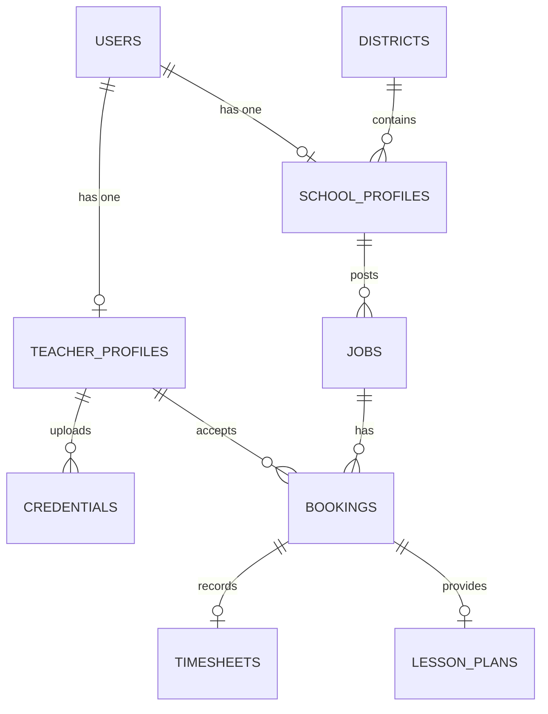

# AI Substitute Teacher Workforce & Scheduling Platform (AltTeacher-AI)

## ১. প্রজেক্টের সংক্ষিপ্ত বিবরণ (Project Overview)
**AltTeacher-AI** হলো একটি ক্লাউড-ভিত্তিক বা ওয়েব-ভিত্তিক ওয়ার্কফোর্স ম্যানেজমেন্ট ও শিডিউলিং প্ল্যাটফর্ম, যা স্কুল এবং সাবস্টিটিউট (বিকল্প) শিক্ষকদের মধ্যে একটি ডিজিটাল সেতু হিসেবে কাজ করে। প্রজেক্টটির মূল লক্ষ্য হলো শিক্ষক অনুপস্থিতির সময় ক্লাসের ধারাবাহিকতা রক্ষা করা এবং প্রশাসনিক কাজগুলো (যেমন: সার্টিফিকেট ভেরিফিকেশন, শিডিউলিং, ডিস্ট্রিক্ট অনবোর্ডিং, পেরোল ট্র্যাকিং এবং কমপ্লায়েন্স মনিটরিং) এআই (AI) এর মাধ্যমে স্বয়ংক্রিয় করা।

---

## ২. মূল ব্যবহারকারী ও তাদের ভূমিকা (Target Users & Roles)
প্ল্যাটফর্মটিতে মূলত ৩টি রোল থাকবে:
1. **বিকল্প শিক্ষক (Substitute Teacher):** যারা নিজের প্রোফাইল তৈরি করবেন, সার্টিফিকেট আপলোড করবেন, ক্লাসরুম প্রেফারেন্স সেট করবেন, অনবোর্ডিং প্রসেস সম্পন্ন করবেন এবং শিডিউল অনুযায়ী ক্লাস বুক করবেন।
2. **স্কুল অ্যাডমিন (School Admin):** যারা শিক্ষক অনুপস্থিতির জন্য রিকোয়েস্ট তৈরি করবেন (Job Post), ক্লাস রুটিন ও লেসন প্ল্যান আপলোড করবেন এবং শিক্ষকদের পারফরম্যান্স রেটিং দেবেন।
3. **ডিস্ট্রিক্ট অ্যাডমিন (District Admin):** যারা ডিস্ট্রিক্টের সব স্কুলের বাজেট ও পেরোল মনিটর করবেন, শিক্ষকদের সার্টিফিকেট ও ব্যাকগ্রাউন্ড চেক চূড়ান্ত অনুমোদন দেবেন এবং কমপ্লায়েন্স রিপোর্ট ট্র্যাক করবেন।

---

## ৩. কোর ফিচারসমূহ (Core Features)

### ক. ডিস্ট্রিক্ট অনবোর্ডিং এবং সার্টিফিকেট ভেরিফিকেশন (Onboarding & Verification)
* **ডিজিটাল অনবোর্ডিং ফানেল:** একজন শিক্ষক রেজিস্ট্রেশন করার পর ধাপে ধাপে তার ডিস্ট্রিক্ট অনবোর্ডিং ফাইল সাবমিট করবেন।
* **AI-Assisted Credential Verification:** শিক্ষক তার টিচিং লাইসেন্স, আইডেন্টিটি কার্ড বা ব্যাকগ্রাউন্ড চেক সার্টিফিকেট (PDF/Image) আপলোড করলে AI স্বয়ংক্রিয়ভাবে তার লাইসেন্স নাম্বার, মেয়াদ এবং সত্যতা যাচাই করবে এবং ডিস্ট্রিক্ট অ্যাডমিনকে এপ্রুভালের জন্য নোটিফাই করবে।

### খ. স্মার্ট শিডিউলিং এবং প্রিফারেন্স ইঞ্জিন (Scheduling & Matching Engine)
* **ক্লাসরুম প্রেফারেন্স:** শিক্ষকরা তাদের পছন্দের গ্রেড (যেমন: Elementary, Middle School), সাবজেক্ট (যেমন: STEM, Arts), পছন্দের স্কুল এবং যে স্কুলগুলোতে যেতে চান না তা সেট করতে পারবেন।
* **অটো-ম্যাচিং অ্যালগরিদম:** কোনো স্কুল থেকে যখন একজন শিক্ষকের অনুপস্থিতির জন্য রিকোয়েস্ট পোস্ট করা হবে, তখন সিস্টেম স্বয়ংক্রিয়ভাবে উপযুক্ত শিক্ষককে নোটিফিকেশন পাঠাবে।
* **ইন্টারেক্টিভ ক্যালেন্ডার:** বুকিং ম্যানেজ করার জন্য ফুল-ক্যালেন্ডার (FullCalendar.js) ভিউ থাকবে।

### গ. লেসন কন্টিনিউইটি এবং AI ক্লাসরুম প্রিপারেশন (Lesson Continuity & AI Prep)
* **লেসন প্ল্যান ট্রান্সফার:** মূল শিক্ষক চলে যাওয়ার আগে তার ড্যাশবোর্ড থেকে পরবর্তী ক্লাসের টপিক এবং স্টুডেন্ট প্রোফাইল আপলোড করে যাবেন।
* **AI Lesson Adaptor & Prep:** 
    * AI মূল লেসন প্ল্যানটিকে সংক্ষিপ্ত (Summarize) করে সাবস্টিটিউট শিক্ষকের জন্য একটি কুইক-রিড গাইড তৈরি করবে।
    * AI স্বয়ংক্রিয়ভাবে ওই ক্লাসের বয়সের উপযোগী কিছু আইসব্রেকার গেম বা ক্লাস ম্যানেজমেন্ট টিপস তৈরি করে দেবে।
    * যদি মূল শিক্ষকের লেসন প্ল্যানটি অপূর্ণাঙ্গ থাকে, তবে AI একটি সম্পূর্ণ সাবস্টিটিউট লেসন প্ল্যান এবং ইন্টারেক্টিভ কুইজ তৈরি করে দেবে।

### ঘ. কমপ্লায়েন্স এবং পেরোল ট্র্যাকিং (Compliance & Payroll)
* **কমপ্লায়েন্স অ্যালার্ট:** কোনো শিক্ষক যাতে ডিস্ট্রিক্টের সর্বোচ্চ ক্লাসের সীমা অতিক্রম না করেন (যেমন: সপ্তাহে সর্বোচ্চ ৩০ ঘণ্টা) বা মেয়াদোত্তীর্ণ লাইসেন্স দিয়ে ক্লাস বুক করতে না পারেন, তা ট্র্যাক করা হবে।
* **পেরোল ট্র্যাকিং:** ডিজিটাল টাইমসশিটের (체크인/체크আউট) মাধ্যমে শিক্ষকের কাজের সময় ট্র্যাকিং এবং স্বয়ংক্রিয়ভাবে পে-রেট ক্যালকুলেশন করে ডিস্ট্রিক্ট ইনভয়েস জেনারেট করা।

---

## ৪. আর্কিটেকচার ও ডাটাবেজ ডিজাইন (Database Schema Design)

প্রজেক্টের মূল ডাটাবেজ টেবিলগুলোর সম্পর্ক নিচে দেওয়া হলো:

### প্রধান টেবিলসমূহ এবং তাদের কলামসমূহ:
1. **users:** `id`, `name`, `email`, `password`, `role` (teacher, school_admin, district_admin, system_admin), `status`.
2. **teacher_profiles:** `id`, `user_id`, `district_id`, `classroom_preferences` (json: subjects, grades, schools), `hourly_rate`, `availability` (json).
3. **school_profiles:** `id`, `user_id`, `district_id`, `school_name`, `address`.
4. **districts:** `id`, `name`, `state`, `compliance_rules` (json).
5. **credentials:** `id`, `teacher_profile_id`, `document_type` (license, background_check), `document_path`, `extracted_info` (json), `verification_status` (pending, approved, rejected), `expiry_date`.
6. **jobs:** `id`, `school_profile_id`, `subject`, `grade_level`, `start_time`, `end_time`, `date`, `status` (open, filled, completed, cancelled), `description`.
7. **bookings:** `id`, `job_id`, `teacher_profile_id`, `status` (confirmed, completed).
8. **timesheets:** `id`, `booking_id`, `check_in_time`, `check_out_time`, `calculated_hours`, `calculated_pay`, `status` (pending, approved).
9. **lesson_plans:** `id`, `booking_id`, `original_plan_text`, `ai_summary`, `ai_generated_activities` (json).

---

## ৫. হ্যাকাথন প্রম্পট স্ট্র্যাটেজি (Vibe Coding: 5 Prompts Strategy)

Vibe Coding প্রতিযোগিতার শর্ত অনুযায়ী আমরা সম্পূর্ণ প্রজেক্টটিকে এমনভাবে ডিজাইন করব যাতে মাত্র **৫টি ধারাবাহিক প্রম্পটের** মাধ্যমে জাজদের এআই সম্পূর্ণ সচল প্রজেক্ট বিল্ড করতে পারে।

### প্রম্পট ১: ফাউন্ডেশন, ডাটাবেজ এবং ইউজার অথেনটিকেশন (Foundation & Auth)
> **প্রম্পট লক্ষ্য:** প্রজেক্টের বেস স্ট্রাকচার, মডেল, মাইগ্রেশন, সিডার এবং রোল-ভিত্তিক অথেনটিকেশন তৈরি করা।
* **কাজসমূহ:** 
    * ডাটাবেজ স্কিমা অনুযায়ী সব মডেল (`User`, `TeacherProfile`, `SchoolProfile`, `District`, `Credential`, `Job`, `Booking`, `Timesheet`, `LessonPlan`) এবং তাদের মাইগ্রেশন তৈরি করা।
    * প্রজেক্ট রান করার জন্য উপযুক্ত ডামি ডেটা তৈরি করতে ডাটাবেজ সিডার তৈরি করা।
    * Tailwind CSS v4 ব্যবহার করে ইউজার রেজিস্ট্রেশন (যেখানে শিক্ষক বা স্কুল সিলেক্ট করা যাবে) এবং লগইন সিস্টেম ডেভেলপ করা।

### প্রম্পট ২: স্কুল পোর্টাল এবং ম্যাচিং ইঞ্জিন (School Portal & Job Matching)
> **প্রম্পট লক্ষ্য:** স্কুলের রিকোয়েস্ট তৈরি করা এবং উপযুক্ত শিক্ষকদের সাথে ম্যাচিং করা।
* **কাজসমূহ:**
    * স্কুল অ্যাডমিন ড্যাশবোর্ড তৈরি করা।
    * স্কুলে বিকল্প শিক্ষকের প্রয়োজনের জন্য "Job Posting Form" তৈরি করা (যেখানে সাবজেক্ট, গ্রেড, সময় ও লেসন প্ল্যান নোটস দেওয়া যাবে)।
    * ব্যাকএন্ডে একটি Matching Engine তৈরি করা যা শিক্ষকের প্রেফারেন্স এবং অ্যাভেইলেবিলিটি অনুযায়ী ওপেন জব লিস্ট ফিল্টার করে শিক্ষকের ড্যাশবোর্ডে প্রদর্শন করবে।
    * বুকিং করার জন্য বুকিং কন্ট্রোলার ও রাউটস তৈরি করা।

### প্রম্পট ৩: শিক্ষক পোর্টাল, ডিস্ট্রিক্ট অনবোর্ডিং এবং এআই ভেরিফিকেশন (Teacher Portal & AI Onboarding)
> **প্রম্পট লক্ষ্য:** শিক্ষকদের প্রোফাইল ম্যানেজমেন্ট এবং এআই দিয়ে অটোমেটিক ডকুমেন্ট ভেরিফিকেশন।
* **কাজসমূহ:**
    * শিক্ষক ড্যাশবোর্ড তৈরি করা, যেখানে শিক্ষকরা তাদের প্রিফারেন্স এবং ক্যালেন্ডার দেখতে পারবেন।
    * ডিস্ট্রিক্ট অনবোর্ডিং চেকলিস্ট এবং ডকুমেন্ট আপলোড ইন্টারফেস।
    * একটি AI ভেরিফিকেশন ফিচার ইন্টিগ্রেট করা (লারাভেলের HTTP ক্লায়েন্ট বা ডামি এআই সার্ভিস ব্যবহার করে) যা আপলোড করা লাইসেন্স ডক বিশ্লেষণ করে নাম, লাইসেন্স নম্বর ও এক্সপায়ারি ডেট এক্সট্র্যাক্ট করবে এবং ডেটাবেজে আপডেট করবে।
    * কমপ্লায়েন্স রুলস ভ্যালিডেশন (যেমন লাইসেন্স এক্সপায়ারড থাকলে বা কাজের লিমিট পার হলে বুকিং ব্লক করা)।

### প্রম্পট ৪: লেসন কন্টিনিউইটি এবং এআই প্রিপারেশন অ্যাসিস্ট্যান্ট (Lesson Continuity & AI Prep)
> **প্রম্পট লক্ষ্য:** বিকল্প শিক্ষকদের ক্লাসরুমে যাওয়ার আগের প্রস্তুতি সহজ করতে এআই ফিচার ইন্টিগ্রেশন।
* **কাজসমূহ:**
    * শিক্ষক ও স্কুল অ্যাডমিনের জন্য লেসন প্ল্যান পেজ তৈরি করা।
    * AI API (যেমন OpenAI/Claude বা লোকাল মক এআই প্রোভাইডার) ব্যবহার করে মূল লেসন নোট থেকে ৩টি গুরুত্বপূর্ণ জিনিস জেনারেট করা:
        ১. ৩ বাক্যে লেসন সামারি।
        ২. ওই বিষয়ের উপর ১০টি ইন্টারেক্টিভ কুইজ প্রশ্ন ও উত্তর।
        ৩. ক্লাসরুমে স্টুডেন্টদের সাথে রিলেশন তৈরির জন্য ৩টি মজার আইসব্রেকার গেম।
    * জেনারেট করা ডেটা PDF আকারে ডাউনলোড করার ব্যবস্থা রাখা।

### প্রম্পট ৫: পেরোল ট্র্যাকিং, রিপোর্ট এবং অ্যাডমিন প্যানেল ইন্টিগ্রেশন (Payroll & AdminLTE Integration)
> **প্রম্পট লক্ষ্য:** পেরোল সিস্টেম, টাইমসশিট এবং ডিস্ট্রিক্ট অ্যাডমিনদের জন্য চমৎকার ভিজ্যুয়াল ড্যাশবোর্ড তৈরি করা।
* **কাজসমূহ:**
    * শিক্ষকদের জন্য ডিজিটাল চেক-ইন এবং চেক-আউট ইন্টারফেস।
    * কাজ শেষে স্বয়ংক্রিয়ভাবে পেরোল ইনভয়েস ও টাইমসশিট জেনারেশন।
    * ডিস্ট্রিক্ট অ্যাডমিন ড্যাশবোর্ড তৈরি করা (যেখানে **AdminLTE** বা আধুনিক Tailwind UI থিম ব্যবহার করা হবে)।
    * ড্যাশবোর্ডে চার্ট/গ্রাফ ব্যবহার করে মাসিক পেরোল খরচ, ভেরিফাইড শিক্ষকদের সংখ্যা এবং পেন্ডিং অনবোর্ডিং রিকোয়েস্টের ভিজ্যুয়াল রিপোর্ট প্রদর্শন করা।

---

## ৬. ফ্রন্টএন্ড ডিজাইনে AdminLTE এর ভূমিকা
আমরা স্কুলের অ্যাডমিন এবং ডিস্ট্রিক্ট অ্যাডমিন প্যানেলগুলোর জন্য ব্যবহারকারীর ডেটা সহজে প্রেজেন্ট করতে `AdminLTE-3.1.0` এর ডিজাইন ও লেআউট ব্যবহার করতে পারি। এটিতে সাইডবার, স্ট্যাটিস্টিক্যাল কার্ডস, ডেটা টেবিল এবং চার্ট রয়েছে যা হ্যাকাথনে জাজদের মুগ্ধ করতে সাহায্য করবে। একই সাথে শিক্ষকদের ভিউটি মোবাইল-ফ্রেন্ডলি করার জন্য আধুনিক রিসপনসিভ Tailwind ডিজাইন ব্যবহার করা হবে।
